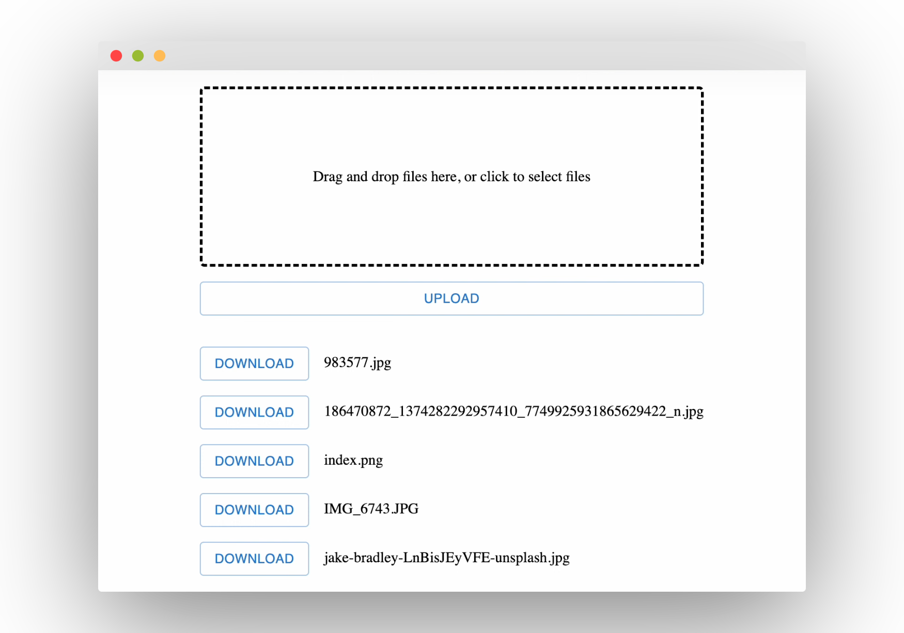
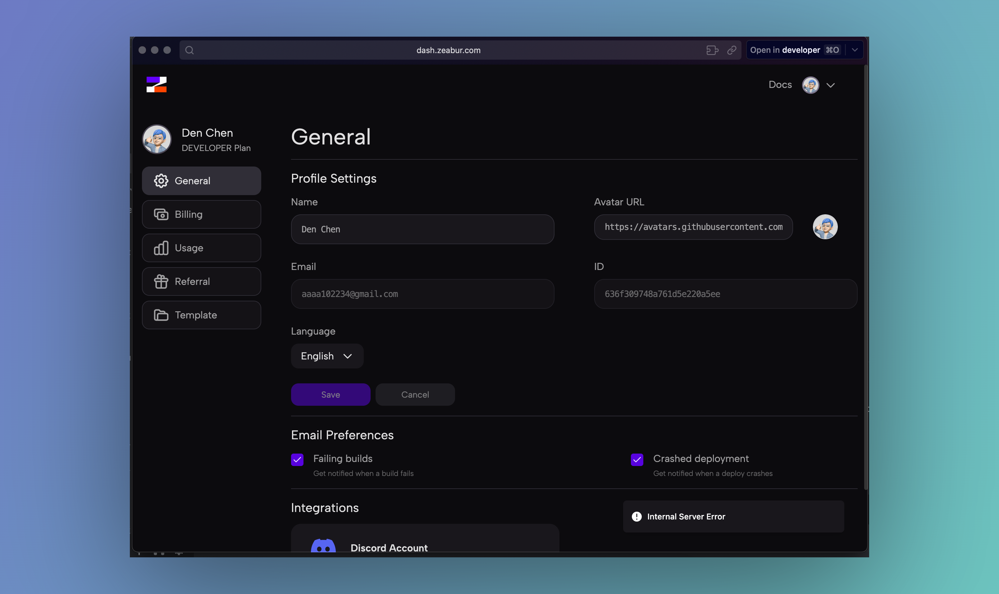

# MinIO Tutorial


This is an example repository demonstrating how to build a basic file system using Minio and TypeScript.

## Tech Stack
- NestJS for backend
- React Vite for frontend
- PostgreSQL
- MinIO

## Quick Start

You can run everything locally :)

Frontend :
```
npm run dev
```
Backend :
```
npm run start
```
PostgreSQL :
```
docker compose up
```
MinIO (Run locally on mac) :
```
brew install minio/stable/minio
export MINIO_CONFIG_ENV_FILE=/etc/default/minio
minio server --console-address :9090
```
MinIO (Run on Zeabur) :

